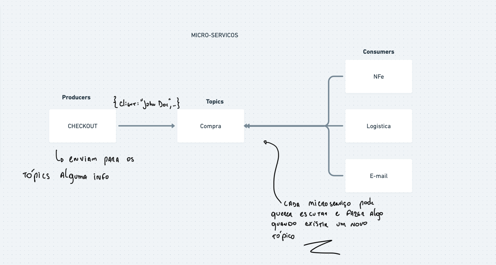

## Instruções

1- Estrutura do projeto:
```
├── node-ie2-kafka-microservice
│ ├── .attachments/ (imagens da documentação)
| | ├── ...
│ ├── .azuredevops/
│ | ├── pull_request_template.md (Template de pull request)
│ ├── .githooks/ (configuração - Setup - Conventional Commits)
│ | |── commit-msg
| | ├── ...
│ ├── docs/ (documentação do projeto)
| | ├── src/ (código fonte)
| | | ├── application/ (código fonte da aplicação)
| | | | ├── entities/ (entidades)
| | | | ├── repositories/ (repositórios)
| | | | ├── use-cases/ (casos de uso)
| | | ├── helpers/ (funções auxiliares)
| | | ├── infra/ (infraestrutura)
| | | | ├── database/ (configuração do banco de dados)
| | | | | ├── prisma/ (configuração do prisma)
| | | | | | ├── mappers/ (mappers)
| | | | | | ├── repositories/ (repositórios)
| | | | ├── http/ (configuração do servidor http)
| | | | | ├── controllers/ (controladores)
| | | | | ├── dtos/ (dtos)
| | | | | ├── view-models/ (view models)
| | | | ├── messaging/ (configuração do kafka)
| | | | | ├── kafka/ (configuração do kafka)
| | | | | | ├── controllers/ (controladores)
│ | ├── README.md (caso não houver a necessidade de uma documentação - editar o arquivo e colocar N/A)
│ ├── src/ (código fonte exemplo)
| | ├── ...
| ├── docs.md (ESTRURA DA WIKI - )
| ├── README.md (este arquivo - README do projeto)
```

2- Projeto no TFS
 * node-ie2-kafka-microservice
 * 1.0.0 - versão do projeto
 * NodeJS - linguagem
 * NestJS - framework
 * TypeScript - linguagem


# node-ie2-kafka-microservice
### NodeJS, NestJS, TypeScript
### Versão 1.0.0

## Descrição
Este projeto tem como objetivo exemplificar a utilização do NestJS com Kafka. O projeto foi desenvolvido utilizando o NestJS, TypeScript, Kafka e Docker.



---

## Pre-requisitos

Antes de iniciar, se assegure que possui os requisitos abaixo:
* Node 14.18.3 ou superior

---

## Compilação / Configuração

Para compilar / instalar o node-ie2-kafka-microservice, siga as seguintes etapas:

Windows, Linux and macOS:

- [Setup - Conventional Commits](https://tfs.iteris.com.br/Iteris%20-%20GC/GC%20-%20Common/_wiki/wikis/GC/28/git-setup-de-gitHook-para-obrigar-mensagens-no-padr%C3%A3o-'Conventional-Commits')
- clone o projeto

### 💻 Instale as dependências:
```bash
npm install
```
ou
```bash
yarn
```
---

## Instalação / Execução

### 💻 Instruções para rodar o projeto
```bash
npm run start:dev
```
ou
```bash
yarn start:dev
```

### 🐞 Executando testes
```bash
npm run test
```
ou
```bash
yarn test
```

---
### 📚 Documentação
Para mais detalhes, por favor, olhe a [documentação do projeto](/docs/README.md).

## Histórico de versões/Autores

* Versão 1.0.0
  - [Jean Oliveira Miranda](https://teams.microsoft.com/l/chat/0/0?users=<jean.miranda@iteris.com.br>)

## Licença
Distribuído sob a licença MIT. Veja `LICENSE` para mais informações.
